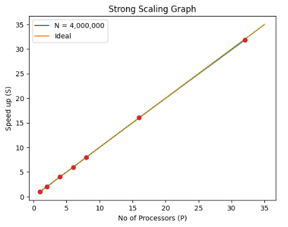

# A0 Report: Benchmarking a Parallel System

## **Overview**
This analysis examines the scalability of a parallel code implementation. The investigation focuses on how the code performs when subjected to different input parameters and processor counts. The report addresses three key questions:
1. What is the function of the code under examination?  
2. How does the code's complexity relate to its input parameters?  
3. In what ways does the code's efficiency and speedup change as we increase the number of processors?  

Through this study, the aim is to provide a comprehensive understanding of the code's behavior and performance across various scenarios.

---

## **What is the Function?**
The code implements **Gaussian Kernel Density Estimation (KDE)** in a 1-dimensional array. It takes two input values, `n` and `k`, representing the problem size and the number of neighbors considered in Gaussian KDE.

---

## **Code Complexity**
The function `omp_gaussian_kde` contains two nested loops:
- The outer loop runs for `n` times, once for each element in vector `x`.  
- The inner loop's number of iterations depends on values `f` and `l`, which are influenced by `k`.  

Additionally, the code can be parallelized across `p` processors.

- **Time Complexity (Sequential)**: \( O(n \cdot k) \)  
- **Time Complexity (Parallel)**: \( O(n \cdot k / p) \)

---

## **Experimental Setup**

### **Hardware and Software Requirements**
To replicate the readings, use the following specifications:
- **CPU**: Intel(R) Xeon(R) Gold 6330  
- **RAM**: 503GB  
- **Compiler**: g++  
- **Compiler Command**: g++ -g -fopenmp -std=c++20 -O2 a0.cpp -o a0

### **Input Parameters**
To complete the experiment, different values of `n` and `k` were tested to achieve readings with a precision of 0.1 seconds. Finally:
- `k` was fixed at **400**.
- `n` was varied as follows:  
\( n = \{1,000,000; 2,000,000; 4,000,000; 6,000,000; 8,000,000; 16,000,000; 32,000,000\} \).

To assess performance across different levels of parallelism:
- Processor counts (`p`) were varied as follows: \( p = \{1, 2, 4, 6, 8, 16, 32\} \).  
- A consistent \( N/P \) ratio was maintained while staying within memory limits.

This approach allowed effective evaluation of scalability and efficiency across different processing scenarios.

---

## **Experiment Results**
The table below summarizes results from experiments conducted with different problem sizes (`n`) and processor counts (`p`). Execution times represent averages from five independent runs for statistical reliability.

# Table: Number of Processors (P) and Input Values (N) when k = 400

| P/N   | 1,000,000 | 2,000,000 | 4,000,000 | 6,000,000 | 8,000,000 | 16,000,000 | 32,000,000 |
|-------|-----------|-----------|-----------|-----------|-----------|------------|------------|
| 1     | 5.5       | 11.14     | 22.28     | 33.43     | 44.58     | 89.1       | 178.38     |
| 2     | 2.79      | 5.58      | 11.15     | 16.74     | 22.31     | 44.61      | 89.2       |
| 4     | 1.39      | 2.79      | 5.58      | 8.35      | 11.18     | 22.35      | 44.7       |
| 6     | 0.93      | 1.86      | 3.73      | 5.59      | 7.45      | 14.91      | 29.82      |
| 8     | 0.7       | 1.4       | 2.78      | 4.19      | 5.59      | 11.18      | 22.36      |
| 16    | 0.35      | 0.7       | 1.39      | 2.09      | 2.79      | 5.58       | 11.18      |
| 32    | 0.18      | 0.35      | 0.7       | 1.05      | 1.4       | 2.79       | 5.59       |

# Table: Speed Up when k = 400

| P/N   | 1,000,000 | 2,000,000 | 4,000,000 | 6,000,000 | 8,000,000 | 16,000,000 | 32,000,000 |
|-------|-----------|-----------|-----------|-----------|-----------|------------|------------|
| 1     | 1.00      | 1.00      | 1.00      | 1.00      | 1.00      | 1.00       | 1.00       |
| 2     | 1.97      | 2.00      | 2.00      | 2.00      | 2.00      | 2.00       | 2.00       |
| 4     | 3.96      | 3.99      | 3.99      | 4.00      | 3.99      | 3.99       | 3.99       |
| 6     | 5.91      | 5.99      | 5.97      | 5.98      | 5.98      | 5.98       | 5.98       |
| 8     | 7.86      | 7.96      | 8.01      | 7.98      | 7.97      | 7.97       | 7.98       |
| 16    | 15.71     | 15.91     | 16.03     | 16.00     | 15.98     | 15.97      | 15.96      |
| 32    | 30.56     | 31.83     | 31.83     | 31.84     | 31.84     | 31.94      | 31.91      |

# Table: Efficiency when k = 400

| P/N   | 1,000,000 | 2,000,000 | 4,000,000 | 6,000,000 | 8,000,000 | 16,000,000 | 32,000,000 |
|-------|-----------|-----------|-----------|-----------|-----------|------------|------------|
| 1     | -         | -         | -         | -         | -         | -          | -          |
| 2     | 0.99      | 1.00      | 1.00      | 1.00      | 1.00      | 1.00       | 1.00       |
| 4     | 0.99      | 1.00      | 1.00      | 1.00      | 1.00      | 1.00       | 1.00       |
| 6     | 0.99      | 1.00      | 1.00      | 1.00      | 1.00      | 1.00       | 1.00       |
| 8     | 0.98      | 0.99      | 1.00      | 1.00      | 1.00      | 1.00       | 1.00       |
| 16    | 0.98      | 0.99      | 1.00      | 1.00      | 1.00      | 1.00       | 1.00       |
| 32    | 0.95      | 0.99      | 0.99      | 1.00      | 1.00      | 1.00       | 1.00       |

---

## **Strong Scaling Analysis**
Strong scaling evaluates how execution time changes when:
- Problem size (`n`) remains constant.
- Number of processors (`p`) increases.

For strong scaling analysis:
- Data for \( n = 4,000,000 \) was used.
- Results are summarized below:

# Table: Runtime, Speedup, and Efficiency when k = 400

| P   | Runtime (s) | Speedup (S) | Efficiency (E) |
|-----|-------------|-------------|----------------|
| 1   | 22.28       | 1           | 1              |
| 2   | 11.15       | 2           | 1              |
| 4   | 5.58        | 3.99        | 1              |
| 6   | 3.73        | 5.98        | 1              |
| 8   | 2.78        | 8.01        | 1              |
| 16  | 1.39        | 16.03       | 1              |
| 32  | 0.7         | 31.83       | 0.99           |

From these results:
- Efficiency was close to **100%** in most cases. This indicates strong scaling as runtime decreases with an increasing number of processors.
- Strong scaling is likely due to smaller values fitting efficiently into cache or memory.

---

## **Conclusion**
The Gaussian Kernel Density Estimation (KDE) implementation demonstrates impressive parallel performance and scalability:
1. Exhibits strong scaling characteristics with near-linear speedup as processor count increases while keeping problem size constant.
2. Maintains consistent performance across various problem sizes.
3. Efficient cache and memory utilization enhance performance for smaller datasets.

This implementation is well-suited for high-performance computing environments and serves as a robust tool for density estimation tasks.
