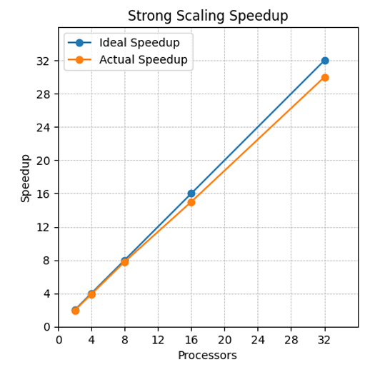

# A1 Report

## **Overview**
Implementing 2D filters efficiently is a critical aspect of image and signal processing, as they enhance the quality of digital images and refine signal data. This report focuses on the development and optimization of an OpenMP-based program designed to accelerate 2D filtering operations, aiming to boost performance and scalability in these essential processing applications.

---

## **Improvement in the Code**
The earlier code submitted in A1Q1 had a race condition. In the new code, the issue was fixed by introducing memoization and an output buffer. All threads are now working on different lines to avoid race conditions.

---

## **What is the Function Doing?**
The `filter2d` function applies a 2D convolution operation to a matrix `A` using a kernel `K`. The function employs OpenMP for parallel processing, dividing the computation among threads to optimize performance.

To handle edge cases and ensure correctness:
- **Boundary Buffers**: Two buffers, `top_memo` and `bottom_memo`, store the top and bottom rows for each block of rows, ensuring edge cells are processed correctly without conflicts.
- **Block Division**: The matrix `A` is divided into blocks, with each block assigned to a thread. Rows within each block are processed sequentially.

### **Main Computation**
For each cell (excluding boundary rows and columns):
1. A 3x3 submatrix centered on the cell is extracted.
2. The submatrix is convolved with the kernel `K`, and results are summed to compute the new value for the cell.

After convolution:
- The first row of the matrix remains unchanged by restoring its values from the `top_memo` buffer.

### **Efficiency**
The function achieves efficient parallel implementation by:
- Balancing workload across threads.
- Managing edge cases with boundary buffers.
- Ensuring sequential processing of rows within blocks.

---

## **Code Complexity**
The computational complexity derives from nested loops that iterate over every element of the \( n \times m \) input matrix. For each element, a fixed-size 3x3 kernel is applied, resulting in constant work per element.

- **Sequential Code Complexity**: \( O(n \cdot m) \)
- **Parallel Code Complexity**: \( O((n \cdot m) / p) \), where \( p \) is the number of threads.

---

## **Experimental Setup**

### **Hardware and Software Requirements**
To replicate the readings, use the following specifications:
- **CPU**: Intel(R) Xeon(R) Gold 6448Y
- **RAM**: 256GB
- **Compiler**: g++ with OpenMP (version 6)
- **Compiler Command**: g++ -g -O2 -fopenmp -std=c++17 a1.cpp -o a1

### **Input Parameters**
The code was tested using:
- A range of matrix sizes (\( N \times M \)).
- Thread counts (`OMP_NUM_THREADS`).

#### Strong Scaling Tests:
- Fixed \( N = M = 10,000 \).
- Increased thread count from 1 to 32.

#### Weak Scaling Tests:
- Scaled \( N \) proportionally with thread count to maintain constant workload per thread.

Each configuration was run multiple times for stable and reliable performance measurements.

---

## **Experiment Results**

### Table: Processors and Runtime when \( N = M = 10,000 \)

| Processors | Runtime (s) | Speedup | Efficiency |
|------------|-------------|---------|------------|
| 1          | 3.9         | -       | -          |
| 2          | 2.0         | 1.95    | 0.98       |
| 4          | 1.0         | 3.90    | 0.98       |
| 8          | 0.5         | 7.80    | 0.98       |
| 16         | 0.26        | 15.00   | 0.94       |
| 32         | 0.13        | 30.00   | 0.94       |

---

## **Strong Scaling Analysis**
The strong scaling results demonstrate that increasing the number of processors significantly reduces runtime while maintaining high efficiency:
- Starting from **3.9 seconds** on a single processor, runtime nearly halves with two processors.
- At **32 processors**, execution time reduces to just **0.13 seconds**, achieving a speedup of about **30x**.
- Efficiency remains consistently high (above **90%**), indicating near-linear scaling with minimal overhead.

---

## **Conclusion**
The implementation of a parallelized 2D filtering function using OpenMP demonstrates substantial performance improvements in runtime reduction and scalability:
1. Addressed earlier issues like race conditions by introducing memoization and output buffers.
2. Managed edge cases effectively using boundary buffers.
3. Optimized thread utilization through thread-specific row processing.

### Key Findings:
- Strong scaling tests show significant runtime reductions as processor count increases, achieving near-linear speedups.
- With **32 processors**, the code achieves a speedup of about **30x**, with efficiency above **90%**.
- The implementation handles large matrix sizes effectively while leveraging modern multicore architectures.

These results highlight the effectiveness of this parallelized implementation for high-performance computing environments in image and signal processing tasks.
