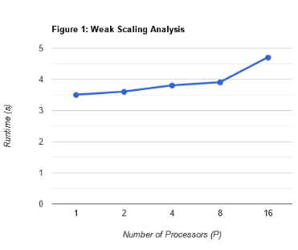

# A2 Report

## **Overview**
This report is a comprehensive analysis of the performance and scalability of an MPI-based program developed for sorting small integers in a distributed memory environment. The objective is to evaluate the scalability and efficiency of the implemented solution across different processor counts and problem sizes.

---

## **Improvement in the Code**
The earlier code submitted in A2Q1 had a limitation where all the numbers were collected on the first processor, potentially leading to memory-related issues. In the new code, this issue has been resolved by properly dividing the work across all processors.

---

## **What is the Function?**
The implemented MPI program sorts an array of small integers distributed across multiple processors. The array is partitioned among \( p \) processors, each counting occurrences of integers within a defined range. A global reduction aggregates these counts, ensuring equal keys are assigned to the same processor while maintaining order.

### **Core Implementation**
The core of this implementation is the `isort` function, which uses non-blocking communication to distribute and collect keys:
- Each processor creates a local bucket for its integers.
- All processors participate in a collective operation to form a global bucket.
- This approach efficiently determines the distribution of elements and constructs the sorted output for each processor in a distributed memory environment.

---

## **Code Complexity**
Let \( n \) denote the total number of elements distributed across \( p \) processors. The key steps are as follows:

1. **Local Counting**:
   - Each process iterates over its subset of approximately \( n/p \) elements to build a local frequency bucket.
   - Time Complexity: \( O(n/p) \) per process.

2. **Global Reduction**:
   - The `MPI_Allreduce` call operates on a fixed-size array of length `RANGE` (a constant, 65536) using a tree-based algorithm.
   - Time Complexity: \( O(\log p) \).

3. **Bucket Assignment and Local Output Generation**:
   - Assigning ranges of values to each process is \( O(1) \), as it depends only on the fixed `RANGE`.
   - Generating the locally sorted subset is \( O(n/p) \).

### **Overall Complexity**
- **Parallel Code Complexity**: \( O(n/p + \log p) \)
- **Sequential Code Complexity**: \( O(n) \)

---

## **Experimental Setup**

### **Hardware and Software Requirements**
To replicate the readings, use the following specifications:
- **CPU**: Intel(R) Xeon(R) Gold 6230
- **RAM**: 128GB
- **Compiler**: `mpicxx`
- **Compiler Command**: mpicxx -std=c++17 -O2 a2.cpp -o a2

### **Input Parameters**
The input size \( n \) (representing the number of integers to sort) and the number of tasks per node were adjusted to evaluate scalability. The following configurations were used:
- Total input sizes (\( n \)): 10 billion, 20 billion, 40 billion, 80 billion, and 160 billion.
- Number of tasks per node: 1 to 16 (fixed at 8 nodes).

Each configuration was run three times to ensure statistical reliability.

---

## **Experiment Results**

### Table: Tasks per Node, Input Size (\( n \)), Runtime (s), and Efficiency when Nodes = 8

| Tasks per Node | Total Input Size (\( n \)) | Runtime (s) | Efficiency |
|-----------------|---------------------------|-------------|------------|
| 1               | 10,000,000,000            | 3.547       | -          |
| 2               | 20,000,000,000            | 3.598       | 98.6%      |
| 4               | 40,000,000,000            | 3.792       | 93.5%      |
| 8               | 80,000,000,000            | 3.990       | 88.9%      |
| 16              | 160,000,000,000           | 4.732       | 74.9%      |

---

## **Weak Scaling Analysis**
The sorting algorithm demonstrated strong weak scaling efficiency for smaller task counts:
- Efficiency remained above **90%** up to **4 tasks per node**.
- Efficiency declined at higher task counts (e.g., **74.9% at 16 tasks per node**) due to increasing communication and synchronization overheads.

### Future Optimizations
To improve performance at higher scales:
- Focus on reducing communication overhead.
- Optimize synchronization costs.

---

## **Conclusion**
The MPI-based sorting algorithm demonstrated strong weak scaling performance:
1. Maintained over **90% efficiency** up to **4 tasks per node**.
2. Efficiency declined to **74.9% at 16 tasks per node**, primarily due to increased communication and synchronization overheads.

### Key Findings:
- The algorithm’s complexity is dominated by \( O(n/p) \) for local operations and \( O(\log p) \) for communication.
- It scales well for large problem sizes.
- With proper optimizations for higher task counts, this program exhibits robust scalability and is well-suited for distributed memory sorting tasks.

